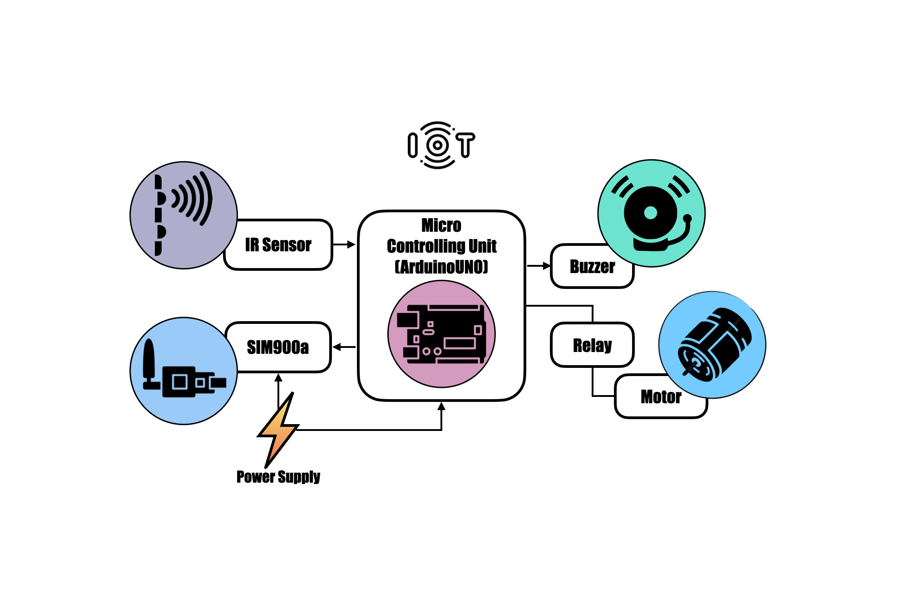

# Smart Driver Drowsiness Detection System

An IoT-based driver drowsiness detection system, with real-time monitoring using IR sensor and alerting via GSM module controlled by Arduino UNO to prevent accidents.

## Features
- Real-time monitoring of driver alertness
- Eye-blink detection using IR sensors
- Buzzer alerts for feedback
- Automatic SMS alerts to emergency contacts via GSM
- Engine cut-off using relay module

## Hardware Used
- Arduino UNO
- GSM Module
- Blink Sensor (IR Sensor)
- Buzzer
- Relay Switch Module

## How It Works
1. The blink sensor monitors eye movements to detect drowsiness.
2. If drowsiness signs are detected:
   - Buzzer alarm activates
   - buzzer triggers
   - SMS alert sent through GSM Module
   - Relay module can cut off engine power if no response

## Block Diagram

## Demo
[▶️ Watch the Demo Video](./assets/iot_working.mp4)

## Contributors
- Jayshree Sharma
- Sonali Das
- Shreya Gholap
- Santhosh Phanitalpak Gandhala

---

> Developed as part of the Internet of Things course.
